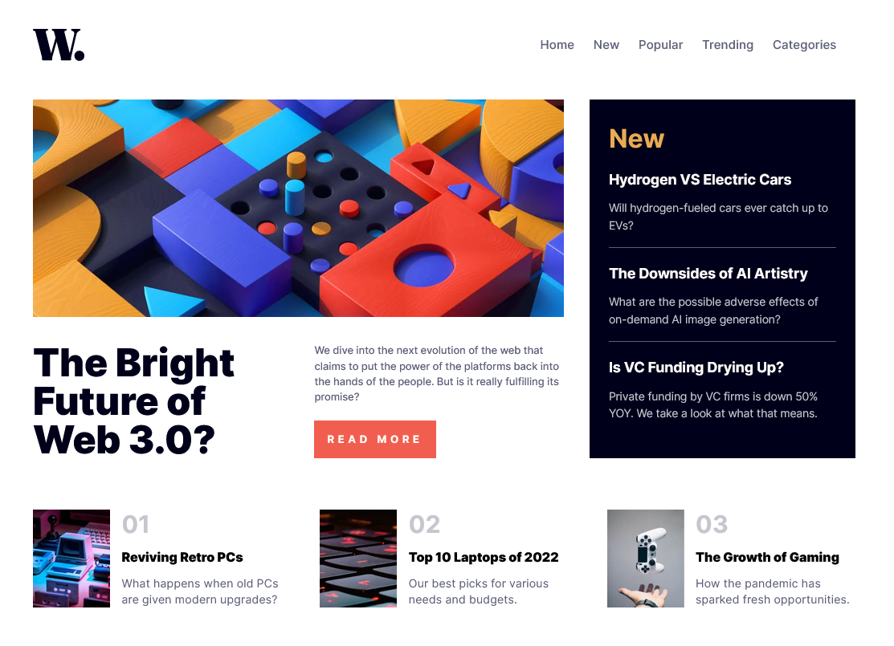

# Frontend Mentor - News homepage solution

This is a solution to the [News homepage challenge on Frontend Mentor](https://www.frontendmentor.io/challenges/news-homepage-H6SWTa1MFl). Frontend Mentor challenges help you improve your coding skills by building realistic projects.

## Table of contents

- [Overview](#overview)
  - [The challenge](#the-challenge)
  - [Screenshot](#screenshot)
  - [Links](#links)
- [My process](#my-process)
  - [Built with](#built-with)
  - [What I learned](#what-i-learned)
  - [Continued development](#continued-development)
  - [Useful resources](#useful-resources)
- [Author](#author)

## Overview

### The challenge

Users should be able to:

- View the optimal layout for the interface depending on their device's screen size
- See hover and focus states for all interactive elements on the page

### Screenshot

### Links

- Solution URL: [Git](https://github.com/PatrykO92/FrontendMentor-news-homepage-challange)
- Live Site URL: [Live](https://frontend-mentor-news-homepage-challange.vercel.app/)

## My process

### Built with

- Semantic HTML5 markup
- CSS custom properties
- Flexbox
- CSS Grid
- CSS modules
- [React](https://reactjs.org/) - JS library
- [Next.js](https://nextjs.org/) - React framework

### What I learned

I have learned how to create a Next.js app and understood the fundamental aspects of this framework. I have also learned how to utilize CSS modules in Next.js. In addition, I acquired knowledge about other basic features of Next.js, such as the Link or Image components that are provided by the framework. Furthermore, I have gained proficiency in utilizing the layout system offered by Next.js. Lastly, I have also acquired basic knowledge regarding routing within the framework.

### Continued development

I am genuinely excited to delve deeper into Next.js, as it will allow me to enhance my understanding of its concepts and unlock its full potential. Furthermore, I have a strong desire to broaden my knowledge of CSS Grid, as it plays a crucial role in web development, and I am eager to grasp its functionality and practical applications in this field.

## Author

- Website - [Portfolio](https://patrykorlowski.netlify.app/)
- Frontend Mentor - [@PatrykO92](https://www.frontendmentor.io/profile/PatrykO92)
